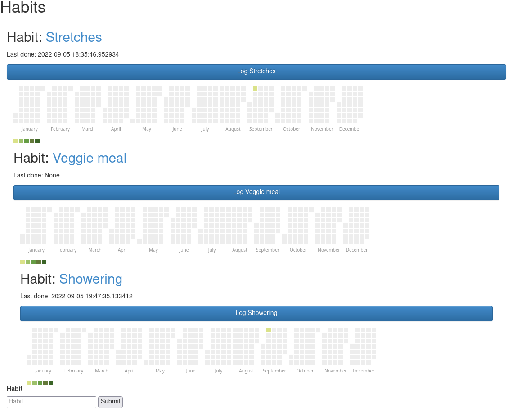

# Habit

A very simple web application to track the habits I want to build.



(I shower regularly already, I promise...)

# Usage

Currently I'm deploying this on a server in my home network using the
debug server.  That's not Suitable For Production(tm), of course, but
my home network is sufficiently isolated for my purposes.

Just to make that clear: if you run this exposed to the internet,
you're in for trouble.

So...start up the server like so:

```
$ make serve
```

Once it's running, navigate to the index page (http://localhost:5000
or whatever your machine's IP address is).  From there:

* You can add a new habit to track by typing the name into the box at
  the bottom and hitting "Submit".
* You can log that you did a particular habit by clicking the "Log
  [habit name]" button.

* You can admire the pretty calendar heat maps on the main page.

* You can click on the habit name to see all the log entries for that
  habit, plus the same pretty calendar heat map.  I suppose that might
  be useful.

Note: this uses (ie, hardcodes) use of an SQLite3 database file named
`habits.db` in the `server` directory of the repo.

# Shortfalls, accusations and TODOs

* I really should be using a WSGI server.

* TODO: Use timezones in dates.  Better timestamp formatting.

* TODO: Add authentication.  Currently there's no authentication at
  all...zero.

* TODO: Allow user to delete or rename a habit.

* TODO: Allow user to delete or update a log entry.

* TODO: Consistify API, and probably settle on a RESTful design.

* TODO: I show only a month when [a mobile device is
  detected](https://stackoverflow.com/a/24600597).  I'd like a button
  to allow a manual toggle.  I'm also sure this method could be
  refactored.

* I'm sure there's much overall to improve in the code, the template
  and the ORM design, but for now this works.

# Thanks

The fact that I can use the work of so many smart people to make
pretty much exactly what I want never ceases to amaze me.  Thank you
to:

* [Flask](https://github.com/realpython/flask-boilerplate) and [Flask-boilerplate](https://github.com/realpython/flask-boilerplate)
* [SQLAlchemy](https://sqlalchemy.org)
* [SQLite](https://sqlite.org)
* [cal-heatmap](https://cal-heatmap.com/)
* [Bootstrap](https://getbootstrap.com)
* [JQuery](https://jquery.com)
* And of course, [Python](https://python.org)

# License

[3-clause BSD](license.txt).  Have fun.
